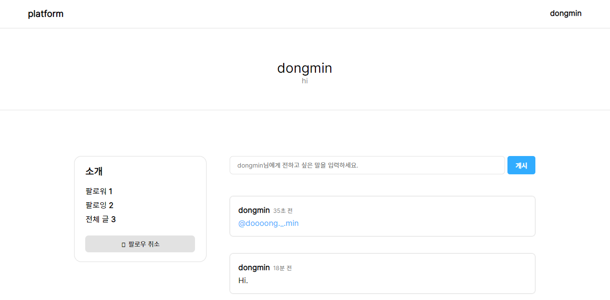
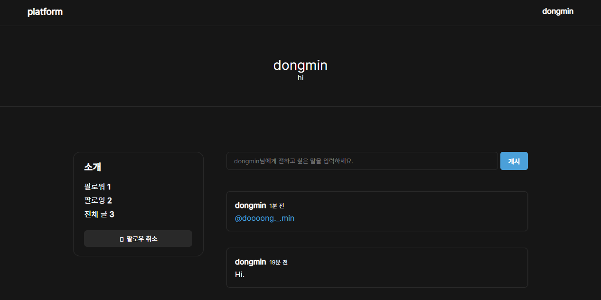

# Platform

simple SNS using svelte.

## Screenshot


White Theme

Dark Theme

## Demo

[Demo Alive!](https://platformweb-demo.netlify.app/)

현재 dashboard에서 해당 페이지로 넘어가지 않는 문제가 발견되었습니다.

## run

1. Download Project

```bash
git clone https://github.com/kangdongmandoo/platform.git

cd platform
```

2. Install Modules

```bash
yarn # or npm install
```

3. set database
   [see more](./docs/run-project.md)

4. Run!

```bash
yarn dev # or npm run dev
```

[localhost:3000](http://localhost:3000)에서 호스팅됩니다.
